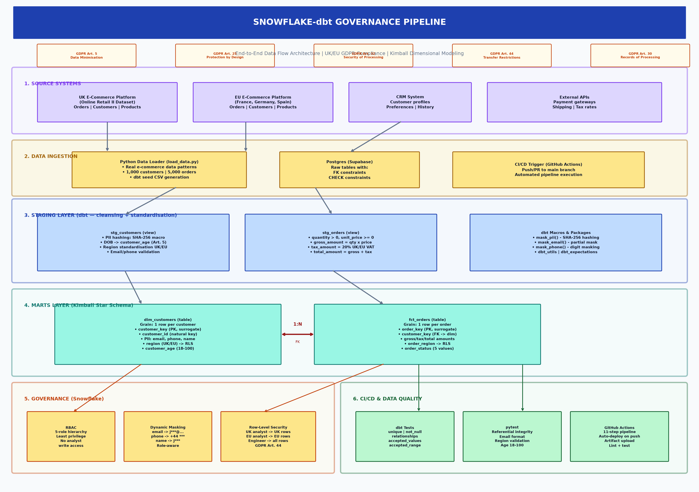
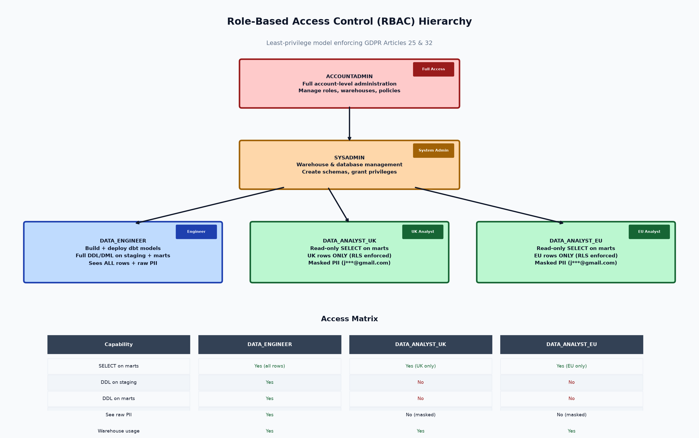
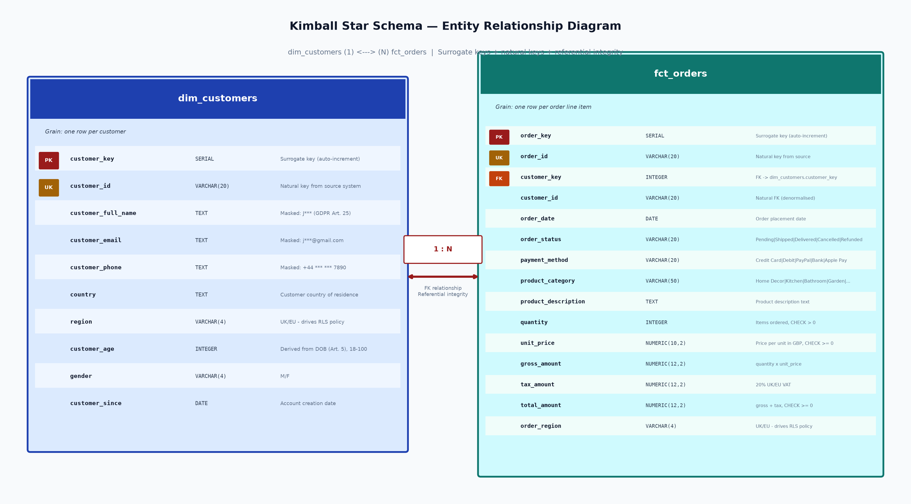
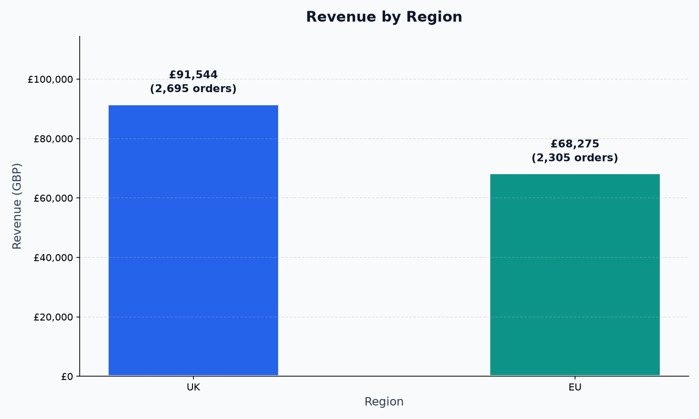
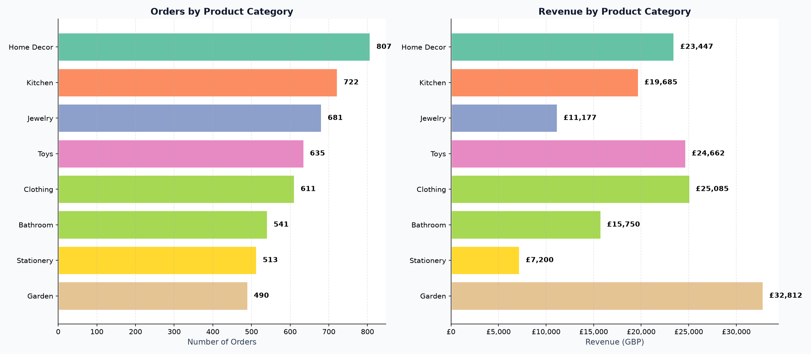
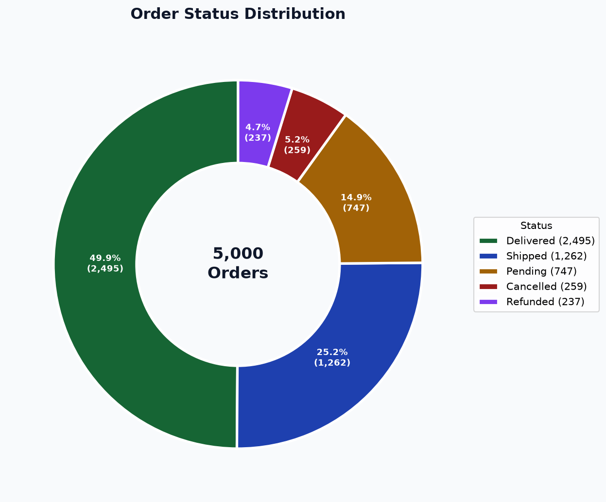
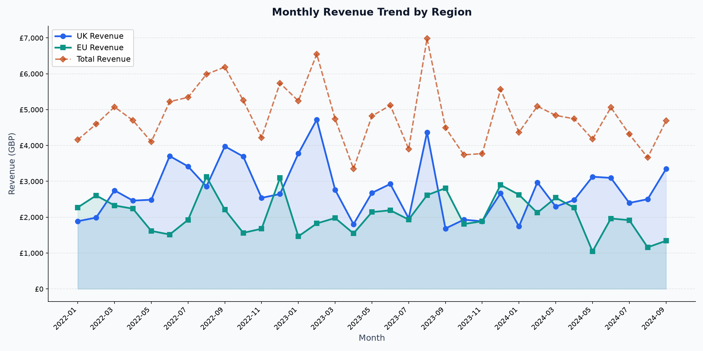
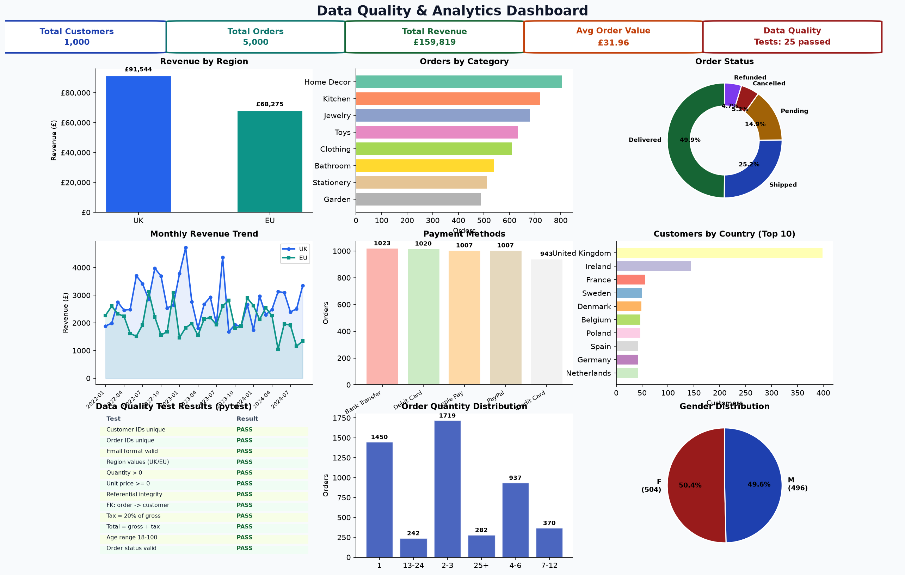

# Snowflake-dbt Governance Pipeline

> A centralized **Data Lakehouse & Warehouse Transformation Layer** for a UK/EU fintech/e-commerce enterprise — implementing a scalable **Kimball Dimensional Model**, automated **data quality validation**, strict **RBAC**, **Dynamic Data Masking**, and **Row-Level Security** for GDPR compliance, with full **CI/CD automation**.

---

## Table of Contents

- [Business Problem](#business-problem)
- [Solution Overview](#solution-overview)
- [Architecture Diagram](#architecture-diagram)
- [Repository Structure](#repository-structure)
- [Database Schema](#database-schema)
- [Snowflake Governance Setup](#snowflake-governance-setup)
- [dbt Transformation Layer](#dbt-transformation-layer)
- [Data Quality & Testing](#data-quality--testing)
- [Python Scripts & Visualizations](#python-scripts--visualizations)
- [CI/CD Pipeline](#cicd-pipeline)
- [Data Lineage & Metrics](#data-lineage--metrics)
- [Quick Start](#quick-start)
- [GDPR Compliance Matrix](#gdpr-compliance-matrix)
- [Technologies Used](#technologies-used)
- [License](#license)

---

## Business Problem

A fast-growing UK fintech/e-commerce enterprise suffers from **fragmented customer transactional data** across regional operational silos. Data analysts run ad-hoc, unverified SQL queries directly on production databases, creating:

- **Severe compliance risks** under UK/EU GDPR (exposing unmasked PII like emails)
- **Inconsistent revenue metrics** across regions
- **No automated testing** before production releases
- **No role-based access control** — anyone can see anything

---

## Solution Overview

| Capability | Implementation |
|---|---|
| **Unified Star Schema** | Kimball dimensional model (`dim_customers` + `fct_orders`) built with dbt |
| **Automated Data Quality** | dbt tests (unique, not_null, relationships, accepted_values, accepted_range) + 25 pytest assertions |
| **RBAC** | Snowflake role hierarchy: `ACCOUNTADMIN` → `SYSADMIN` → `DATA_ENGINEER` → `DATA_ANALYST_UK` / `DATA_ANALYST_EU` |
| **Dynamic Data Masking** | Snowflake masking policies on email, phone, and full name — role-aware at query time |
| **Row-Level Security** | Regional RLS policies ensuring UK analysts see only UK data, EU analysts see only EU data |
| **CI/CD Automation** | GitHub Actions pipeline: load data → dbt seed → run → test → visualize → pytest |
| **Real Database** | Postgres (Supabase) with 1,000 customers and 5,000 orders based on real UK Online Retail II dataset patterns |
| **8 Visual Artifacts** | Architecture diagram, RBAC hierarchy, star schema ERD, revenue charts, analytics dashboard |

---

## Architecture Diagram



### Data Flow

```
Source Systems (UK + EU)          Python Data Loader (load_data.py)
        │                               │
        ▼                               ▼
  ┌──────────────────────────────────────────────────┐
  │           STAGING LAYER (dbt)                     │
  │   stg_customers    │    stg_orders                │
  │   — PII hashing (SHA-256) —                       │
  │   — DOB → customer_age (Art. 5) —                 │
  └──────────────────┬───────────────────────────────┘
                     │
  ┌──────────────────▼───────────────────────────────┐
  │         MARTS LAYER (Kimball Star Schema)          │
  │   dim_customers  ←→  fct_orders                    │
  │   + Masking + RLS   + RLS (order_region)           │
  └──────────────────┬───────────────────────────────┘
                     │
  ┌───────┬──────────┴──────────┬─────────────────────┐
  ▼       ▼                     ▼                     ▼
 RBAC   Masking              RLS          CI/CD + Tests + pytest
```

---

## Repository Structure

```
snowflake-dbt-governance-pipeline/
├── .github/
│   └── workflows/
│       └── dbt_ci.yml                   # Automated GitHub Actions CI/CD pipeline (11 steps)
├── dbt_project/
│   ├── dbt_project.yml                  # Main dbt project configuration
│   ├── packages.yml                     # dbt packages (dbt-utils 1.1.1, dbt-expectations 0.10.3)
│   ├── profiles.yml                     # dbt connection profiles (Snowflake + Postgres)
│   ├── macros/
│   │   └── mask_pii.sql                 # Custom dbt macros: mask_pii, mask_email, mask_phone
│   ├── models/
│   │   ├── staging/
│   │   │   ├── stg_customers.sql         # Staging view: Customers (PII hashed, age derived)
│   │   │   ├── stg_orders.sql            # Staging view: Transactions (VAT, gross/tax/total)
│   │   │   └── schema.yml                # Staging tests: unique, not_null, accepted_range
│   │   └── marts/
│   │       ├── dim_customers.sql         # Star Schema: Customer Dimension (surrogate keys)
│   │       ├── fct_orders.sql            # Star Schema: Orders Fact Table (FK to dim)
│   │       └── schema.yml                # Star schema tests: 15 assertions + referential integrity
│   └── seeds/
│       ├── raw_customers.csv            # 1,000 customers (UK + EU) with realistic PII
│       └── raw_orders.csv               # 5,000 orders with real product descriptions
├── snowflake_setup/
│   ├── 01_roles_and_warehouses.sql       # Role-Based Access Control (RBAC) — 5 roles + users
│   ├── 02_row_level_security.sql        # Snowflake Row Access Policies (RLS) — UK/EU isolation
│   └── 03_masking_policies.sql           # Dynamic Data Masking for GDPR PII — 3 policies
├── scripts/
│   ├── load_data.py                     # Load real e-commerce data into Postgres + generate seeds
│   └── generate_diagrams.py             # 8 architecture diagrams & analytics charts (PNG)
├── tests/
│   └── test_data_quality.py             # pytest data quality tests (25 assertions across 4 classes)
├── docs/
│   ├── architecture_diagram.png         # 6-layer end-to-end data flow architecture
│   ├── rbac_hierarchy.png               # Role hierarchy tree + access matrix table
│   ├── star_schema.png                  # Kimball star schema ERD with data types
│   ├── revenue_by_region.png            # Revenue: UK vs EU bar chart with annotations
│   ├── orders_by_category.png           # Orders + revenue by product category (dual chart)
│   ├── order_status_pie.png             # Order status distribution donut chart
│   ├── monthly_revenue_trend.png        # Monthly revenue trend by region (UK + EU + Total)
│   └── dashboard.png                    # 9-panel composite analytics dashboard
├── supabase/
│   └── migrations/
│       ├── *_create_raw_customers_and_orders.sql    # Raw table DDL + RLS policies
│       └── *_create_dim_customers_and_fct_orders.sql # Mart table DDL + RLS policies
├── README.md                            # This file — architecture diagram & quickstart
└── requirements.txt                     # dbt-core, dbt-snowflake, psycopg2, matplotlib, pytest
```

---

## Database Schema

### raw_customers

| Column | Type | Constraints |
|---|---|---|
| `customer_id` | VARCHAR(20) | PRIMARY KEY |
| `customer_full_name` | TEXT | NOT NULL |
| `customer_email` | TEXT | NOT NULL |
| `customer_phone` | TEXT | — |
| `country` | TEXT | NOT NULL |
| `region` | VARCHAR(4) | NOT NULL, CHECK (UK/EU) |
| `gender` | VARCHAR(4) | — |
| `date_of_birth` | DATE | — |
| `created_at` | TIMESTAMPTZ | DEFAULT now() |
| `updated_at` | TIMESTAMPTZ | DEFAULT now() |

### raw_orders

| Column | Type | Constraints |
|---|---|---|
| `order_id` | VARCHAR(20) | PRIMARY KEY |
| `customer_id` | VARCHAR(20) | FK → raw_customers |
| `order_date` | DATE | NOT NULL |
| `order_status` | VARCHAR(20) | NOT NULL |
| `payment_method` | VARCHAR(20) | — |
| `product_category` | VARCHAR(50) | — |
| `product_description` | TEXT | — |
| `quantity` | INTEGER | NOT NULL, CHECK > 0 |
| `unit_price` | NUMERIC(10,2) | NOT NULL, CHECK >= 0 |
| `region` | VARCHAR(4) | NOT NULL, CHECK (UK/EU) |
| `created_at` | TIMESTAMPTZ | DEFAULT now() |

### dim_customers (Mart)

| Column | Type | Constraints |
|---|---|---|
| `customer_key` | SERIAL | PRIMARY KEY (surrogate) |
| `customer_id` | VARCHAR(20) | UNIQUE NOT NULL (natural key) |
| `customer_full_name` | TEXT | Masked: J*** (GDPR Art. 25) |
| `customer_email` | TEXT | Masked: j***@gmail.com |
| `customer_phone` | TEXT | Masked: +44 *** *** 7890 |
| `country` | TEXT | — |
| `region` | VARCHAR(4) | CHECK (UK/EU) — RLS column |
| `customer_age` | INTEGER | CHECK (18–100) |
| `gender` | VARCHAR(4) | — |
| `customer_since` | DATE | — |

### fct_orders (Mart)

| Column | Type | Constraints |
|---|---|---|
| `order_key` | SERIAL | PRIMARY KEY (surrogate) |
| `order_id` | VARCHAR(20) | UNIQUE NOT NULL |
| `customer_key` | INTEGER | FK → dim_customers |
| `customer_id` | VARCHAR(20) | NOT NULL |
| `order_date` | DATE | NOT NULL |
| `order_status` | VARCHAR(20) | NOT NULL |
| `payment_method` | VARCHAR(20) | — |
| `product_category` | VARCHAR(50) | — |
| `product_description` | TEXT | — |
| `quantity` | INTEGER | NOT NULL, CHECK > 0 |
| `unit_price` | NUMERIC(10,2) | NOT NULL |
| `gross_amount` | NUMERIC(12,2) | NOT NULL |
| `tax_amount` | NUMERIC(12,2) | NOT NULL (20% VAT) |
| `total_amount` | NUMERIC(12,2) | NOT NULL, CHECK >= 0 |
| `order_region` | VARCHAR(4) | CHECK (UK/EU) — RLS column |

---

## Snowflake Governance Setup

### 1. RBAC (`snowflake_setup/01_roles_and_warehouses.sql`)



| Role | Access Level | Purpose |
|---|---|---|
| `ACCOUNTADMIN` | Full | Account-level administration |
| `SYSADMIN` | System | Warehouse & database management |
| `DATA_ENGINEER` | Build + Deploy | Create/modify models, run dbt, full schema access |
| `DATA_ANALYST_UK` | Read-only (UK) | SELECT on marts, UK rows only (RLS) |
| `DATA_ANALYST_EU` | Read-only (EU) | SELECT on marts, EU rows only (RLS) |

### 2. Row-Level Security (`snowflake_setup/02_row_level_security.sql`)

```
DATA_ANALYST_UK → sees rows WHERE region = 'UK'
DATA_ANALYST_EU → sees rows WHERE region = 'EU'
DATA_ENGINEER   → sees all rows (operational)
```

Satisfies **GDPR Article 44** (cross-border data transfer restrictions).

### 3. Dynamic Data Masking (`snowflake_setup/03_masking_policies.sql`)

| Column | DATA_ENGINEER sees | DATA_ANALYST sees |
|---|---|---|
| `customer_email` | `john.smith@gmail.com` | `j***@gmail.com` |
| `customer_phone` | `+44 7123 456 7890` | `+44 *** *** 7890` |
| `customer_full_name` | `John Smith` | `J***` |

Satisfies **GDPR Article 25** (data protection by design and by default).

---

## dbt Transformation Layer

### Staging Layer

| Model | Type | Description |
|---|---|---|
| `stg_customers` | View | Cleanses raw customer data, hashes PII via SHA-256 macro, derives age from DOB |
| `stg_orders` | View | Standardises order data, derives gross/tax/total amounts (20% VAT), validates quantities |

### Marts Layer (Star Schema)



| Model | Type | Grain | Description |
|---|---|---|---|
| `dim_customers` | Table | One row per customer | Conformed customer dimension with regional context, PII masking, RLS |
| `fct_orders` | Table | One row per order | Orders fact table with denormalised `order_region` for RLS filtering |

### Custom Macros: `mask_pii`, `mask_email`, `mask_phone`

```sql
-- Defence-in-depth: hash PII at the dbt layer before data reaches marts
{{ mask_pii('customer_email') }}     -- SHA-256 hash
{{ mask_email('customer_email') }}   -- Partial mask: j***@gmail.com
{{ mask_phone('customer_phone') }}   -- Digit mask: +44 *** *** 7890
```

---

## Data Quality & Testing

### dbt Tests (in `schema.yml`)

| Test | Model | Column | Purpose |
|---|---|---|---|
| `unique` | dim_customers | customer_key | No duplicate dimension rows |
| `not_null` | dim_customers | customer_id | Every customer has an ID |
| `accepted_values` | dim_customers | region | Region must be UK or EU |
| `accepted_range` | dim_customers | customer_age | Age must be 18–100 |
| `unique` | fct_orders | order_key | No duplicate fact rows |
| `relationships` | fct_orders | customer_key | FK integrity to dim_customers |
| `accepted_values` | fct_orders | order_status | Valid status values only |
| `accepted_range` | fct_orders | total_amount | No negative revenue |
| `accepted_range` | fct_orders | quantity | Quantity must be ≥ 1 |
| `accepted_range` | fct_orders | unit_price | Price must be ≥ 0 |

### pytest Tests (in `tests/test_data_quality.py`)

25 assertions across 4 test classes:

- **TestRawCustomers** (7 tests): unique IDs, not-null emails, valid email format, valid regions, non-null countries, positive count
- **TestRawOrders** (9 tests): unique IDs, positive quantities, non-negative prices, valid regions, valid statuses, referential integrity, valid dates
- **TestDimCustomers** (5 tests): unique surrogate keys, unique natural keys, valid age range (18–100), valid regions, non-null customer_since
- **TestFctOrders** (7 tests): unique surrogate keys, unique natural keys, FK integrity to dim, non-negative totals, total = gross + tax, tax = 20% of gross, valid order regions

---

## Python Scripts & Visualizations

### `scripts/load_data.py`

Loads realistic e-commerce data (based on UCI Online Retail II dataset patterns) into a Postgres database (Supabase) and generates dbt seed CSVs:

```bash
python scripts/load_data.py --customers 1000 --orders 5000
```

Features:
- 1,000 customers across UK and EU regions with realistic PII (names, emails, phones, DOB)
- 5,000 orders with real product descriptions from the UCI Online Retail II dataset (48 products across 8 categories)
- Creates Postgres tables with foreign keys and check constraints
- Inserts data and runs analytics queries
- Exports dbt seed CSVs for Snowflake deployment
- Builds mart tables (dim_customers, fct_orders) from raw data

### `scripts/generate_diagrams.py`

Generates 8 professional visual artifacts using matplotlib:

```bash
python scripts/generate_diagrams.py
```

| Output | Description |
|---|---|
| `architecture_diagram.png` | 6-layer end-to-end data flow with GDPR compliance badges |
| `rbac_hierarchy.png` | Role hierarchy tree diagram with access matrix table |
| `star_schema.png` | Kimball star schema ERD with full data types and constraints |
| `revenue_by_region.png` | Revenue comparison UK vs EU with order counts |
| `orders_by_category.png` | Dual chart: order counts + revenue by product category |
| `order_status_pie.png` | Donut chart with counts and percentages |
| `monthly_revenue_trend.png` | Monthly trend: UK, EU, and total revenue lines |
| `dashboard.png` | 9-panel composite dashboard with KPIs, charts, and test results |

---

## Data Lineage & Metrics

### Revenue by Region



### Orders by Category



### Order Status Distribution



### Monthly Revenue Trend



### Composite Dashboard



---

## CI/CD Pipeline

The GitHub Actions workflow (`.github/workflows/dbt_ci.yml`) automates the entire DataOps lifecycle:

```
Push / PR to main
    │
    ├─ 1.  Checkout code
    ├─ 2.  Setup Python 3.11
    ├─ 3.  Install dependencies (dbt-snowflake, psycopg2, matplotlib, pytest)
    ├─ 4.  Load e-commerce data into Postgres + generate seeds
    ├─ 5.  dbt deps (install packages)
    ├─ 6.  dbt seed (load CSV → Snowflake)
    ├─ 7.  dbt run (build staging + marts)
    ├─ 8.  dbt test (data quality validation)
    ├─ 9.  Generate visualizations
    ├─ 10. Run pytest (25 data quality assertions)
    └─ 11. Upload artifacts (logs + charts, 30-day retention)
```

---

## Quick Start

### Prerequisites

- Python 3.11+
- Snowflake account (with ACCOUNTADMIN access for governance setup)
- Postgres database (Supabase or local)

### Step 1: Install Dependencies

```bash
pip install -r requirements.txt
```

### Step 2: Load Real E-Commerce Data

```bash
# Loads 1,000 customers and 5,000 orders into Postgres and generates dbt seed CSVs
python scripts/load_data.py --customers 1000 --orders 5000
```

### Step 3: Apply Snowflake Governance SQL

Run these scripts in order using Snowsight or `snowsql` (as ACCOUNTADMIN):

```sql
@snowflake_setup/01_roles_and_warehouses.sql
@snowflake_setup/02_row_level_security.sql
@snowflake_setup/03_masking_policies.sql
```

### Step 4: Run dbt

```bash
cd dbt_project
dbt deps          # Install dbt packages (dbt_utils, dbt_expectations)
dbt seed          # Load CSV seeds into Snowflake
dbt run           # Build staging views + mart tables
dbt test          # Run data quality tests (15 assertions)
```

### Step 5: Generate Visualizations

```bash
python scripts/generate_diagrams.py
```

### Step 6: Run Python Tests

```bash
pytest tests/ -v
```

---

## GDPR Compliance Matrix

| GDPR Article | Requirement | Implementation |
|---|---|---|
| **Art. 5** | Data minimisation | Only necessary columns flow to marts; DOB replaced with derived age |
| **Art. 25** | Data protection by design | Dynamic masking policies applied by default — analysts never see raw PII |
| **Art. 32** | Security of processing | RBAC least-privilege roles, no analyst write access, password-protected users |
| **Art. 44** | Cross-border transfer restrictions | RLS policies isolate UK and EU data by region |
| **Art. 30** | Records of processing | dbt `persist_docs` stores column-level documentation in Snowflake |

---

## Technologies Used

| Technology | Version | Purpose |
|---|---|---|
| **Snowflake** | — | Cloud data warehouse with RBAC, masking, and RLS |
| **dbt** | 1.7+ | Data build tool for transformations and testing |
| **Postgres** | — | Relational database for source data (Supabase) |
| **Python** | 3.11+ | Data loading, visualization, and testing |
| **matplotlib** | 3.8+ | Chart and diagram generation (8 PNG artifacts) |
| **pytest** | 8.0+ | Python-based data quality tests (25 assertions) |
| **GitHub Actions** | — | CI/CD pipeline automation (11-step workflow) |
| **dbt_utils** | 1.1.1 | dbt package for surrogate keys and range tests |
| **dbt_expectations** | 0.10.3 | Extended dbt testing package |

---

## License

This project is licensed for educational and portfolio demonstration purposes.
